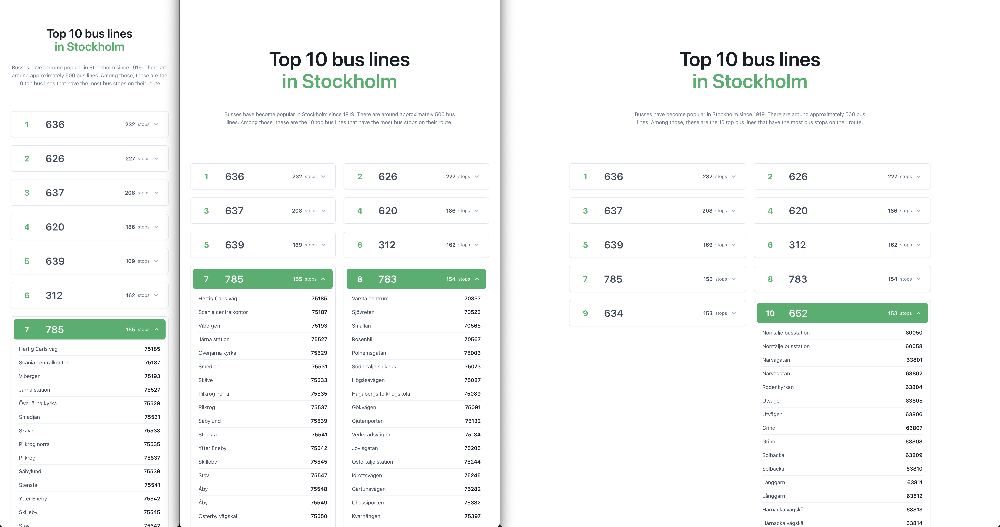

# TopBuses Demo

## Prerequisites

This project is created with Java 11+ and Node.js 16+. In order to run the project, you need to have these both Java and JavaScript runtimes.

The easy way to install them.

```.
brew install java11
brew install node
```

Check their version,

```.
java -version
openjdk version "11.0.15" 2022-04-19

node -v
v16.14.2
```

## Running the server and client

Open your favorite terminal and run the server,

```.
cd server
./mvnw spring-boot:run
```

With another terminal, run the client,

```sh
cd client
yarn dev
```

Visit <http://localhost:3000> for the client

Visit <http://localhost:8080/api/buses/top> for the REST API server


